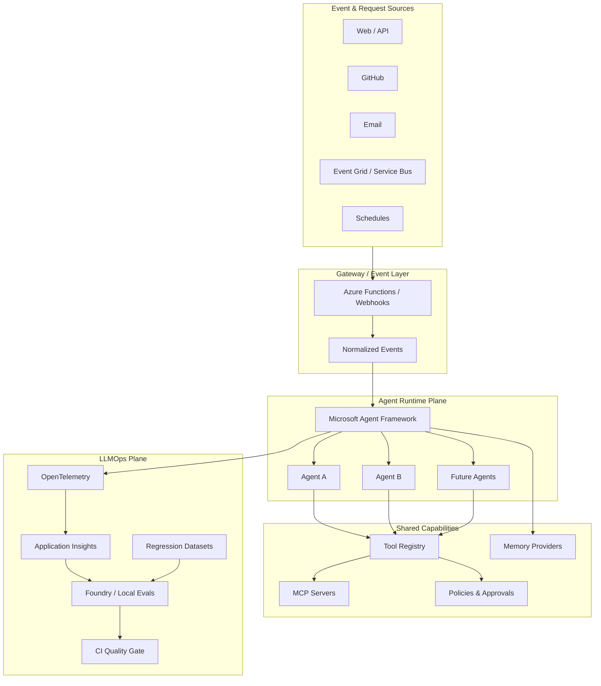

# Azure Agent Harness

> Community project. Not affiliated with or endorsed by Microsoft.

> An **enterprise-grade starter harness** for building, evaluating, observing, governing, and deploying Microsoft Agent Framework applications on Azure.

Azure Agent Harness is **not another agent framework**. It is an opinionated, open-source project skeleton that connects the production concerns teams repeatedly have to assemble around an agent runtime:

- Microsoft Agent Framework
- Microsoft Foundry models and hosted agents
- Azure Functions / Durable Extension when long-running orchestration is required
- MCP and native function tools
- deterministic tool policies and approval boundaries
- working / episodic / semantic-memory interfaces
- OpenTelemetry and Application Insights
- Agent Framework + Microsoft Foundry evaluations
- regression datasets and release quality gates
- GitHub Actions CI/CD
- repeatable local and Azure deployment patterns

The goal is simple: **clone the repository, define an agent, define tools, define policies and evals, then deploy without inventing an LLMOps platform from scratch.**

> **Status:** early open-source starter. The architecture is production-minded, but every organization must still perform its own security, compliance, threat-modeling, scale, and cost reviews before production use.

## Why this exists

The Azure ecosystem already contains the major primitives for production agents. Microsoft Agent Framework provides the runtime, tool calling, approvals, MCP support and evaluation APIs. Microsoft Foundry can provide managed agent hosting, models, tracing and cloud evaluations. Azure Monitor/Application Insights provides telemetry. GitHub provides CI/CD.

What is usually missing is the **opinionated glue**:

```text
Agent run
   ↓
Trace
   ↓
Observe
   ↓
Evaluate
   ↓
Diagnose
   ↓
Quality / policy gate
   ↓
Release or block
   ↓
Proposed improvement
   ↓
Pull request
   ↓
Evaluate again
```

Azure Agent Harness is intended to provide that glue while staying thin enough that Microsoft Agent Framework remains the agent runtime.

## Architecture



## Hosting choices

This starter deliberately treats hosting as a deployment choice rather than an agent-design choice.

### Foundry Hosted Agents — default managed path

Use this when you want Microsoft Foundry to operate the hosted agent runtime, scaling, identity, sessions and protocol endpoints. The repository includes a Responses-protocol host under `deploy/foundry/`.

### Azure Functions + Durable Extension — event / orchestration path

Use this when the application needs Azure Functions triggers, durable workflows, reliable long-running execution, external-event waits, or orchestration across multiple steps. The repository includes a Functions starter under `deploy/functions/`.

### Hybrid

A common enterprise pattern is:

```text
External event
   ↓
Azure Function / webhook
   ↓
validation + dedupe + normalization
   ↓
Foundry Hosted Agent
   ↓
typed / MCP tools
   ↓
deterministic action
```

Do not introduce a hybrid split unless it simplifies a real operational requirement.

## Authentication

The Foundry Responses host and the Azure Functions/Durable starter support inbound Entra ID authentication when `AUTH_MODE=entra`.
Bearer tokens are validated for tenant, issuer, audience, lifetime and RS256 signature before the request reaches the agent runtime.
Validated callers become request-scoped principals, and every `@harness_tool` call checks the required permission for the tool risk level.
For the Functions host, the validated principal is serialized into durable run options and rehydrated inside the entity before tool authorization.
Permissions are flat: `Tools.Write` does not imply `Tools.Read`, and `Tools.Destructive` does not imply lower-risk access.
For local development, `AUTH_MODE=disabled` runs tools without a principal.
For production, startup validation requires Entra auth configuration.
See [docs/AUTH.md](docs/AUTH.md) for app registration, environment variables, role mapping and host-specific behavior.

## Enterprise-grade principles

This project uses the term **enterprise-grade** to describe architectural expectations, not a compliance certification. The starter is designed around these principles:

1. **Identity over shared secrets** — use Entra ID / Managed Identity in production where supported.
2. **Least privilege** — each agent receives only the tools it needs.
3. **Deterministic guardrails** — important business rules live in code/policy, not only in prompts.
4. **Approval boundaries** — high-risk tool calls can require human approval.
5. **Auditability** — agent runs, tool calls, versions and outcomes are traceable.
6. **Idempotency** — externally mutating operations should be safe to retry.
7. **Observability by default** — traces, latency, failures and token usage should be available from the first deployment.
8. **Evaluation before deployment** — agent changes pass deterministic and model-based evals before release.
9. **Version everything** — code, prompts, policies, models, tools, datasets and evaluator versions.
10. **No autonomous self-mutation in production** — agents may propose improvements through PRs; production changes still pass tests and release gates.
11. **Portable abstractions** — memory, tools and hosting are interfaces rather than hard-coded application assumptions.
12. **Secure defaults** — secrets stay outside Git; verbose tool errors are not exposed to the model in production.

## Repository layout

```text
azure-agent-harness/
├── src/azure_agent_harness/
│   ├── agents/             # thin agent definitions
│   ├── auth/               # inbound Entra auth + principal context
│   ├── runtime/            # Agent Framework construction/runtime
│   ├── tools/              # tool registry + examples
│   ├── policies/           # deterministic authorization/risk rules
│   ├── memory/             # provider interfaces + implementations
│   └── llmops/             # tracing and evaluation helpers
├── llmops/
│   ├── datasets/           # versioned regression cases
│   └── rubrics/            # agent-specific scoring rubrics
├── deploy/
│   ├── foundry/            # Foundry Hosted Agent entry point
│   └── functions/          # Azure Functions/Durable starter
├── .github/workflows/      # CI, eval and security gates
├── scripts/                # developer utilities / scaffolding
├── tests/
└── docs/
```

## Quick start

### 1. Prerequisites

- Python 3.11+
- an Azure subscription
- a Microsoft Foundry project and model deployment for cloud execution
- Azure CLI authenticated locally

### 2. Install

```bash
git clone https://github.com/YOUR_ORG/azure-agent-harness.git
cd azure-agent-harness
python -m venv .venv
source .venv/bin/activate     # Windows: .venv\\Scripts\\activate
pip install -e ".[dev,foundry]"
cp .env.example .env
```

Set:

```bash
FOUNDRY_PROJECT_ENDPOINT=https://<resource>.services.ai.azure.com/api/projects/<project>
AZURE_AI_MODEL_DEPLOYMENT_NAME=<your-model-deployment>
```

Then authenticate:

```bash
az login
```

### 3. Run the example agent locally

```bash
python -m azure_agent_harness.agents.example.main "What can this harness do?"
```

### 4. Run unit tests

```bash
pytest
```

### 5. Run local deterministic evals

```bash
python -m azure_agent_harness.llmops.local_eval
```

### 6. Host through the Foundry Responses protocol

```bash
pip install -e ".[foundry-hosting]"
python deploy/foundry/main.py
```

The host binds to port `8088` by default and exposes `POST /responses`.

For production deployment, follow `deploy/foundry/README.md` and the current Microsoft Foundry `azd ai agent` workflow.

## Define an agent

The example definition is intentionally thin:

```python
from azure_agent_harness.runtime.factory import build_agent
from azure_agent_harness.tools.example import get_service_status

agent = build_agent(
    name="example-agent",
    instructions="Be concise and use tools when useful.",
    tools=[get_service_status],
)
```

The long-term design goal is for a new agent to consist primarily of:

```yaml
name: customer-support

tools:
  - customer.lookup
  - subscription.read
  - subscription.cancel_at_period_end

memory:
  working: true
  episodic: true
  semantic: false

permissions:
  subscription.cancel_at_period_end: autonomous
  refund.create: prohibited

evals:
  - task_completion
  - tool_selection
  - policy_compliance
```

The platform should supply the runtime, telemetry, policies, eval orchestration and deployment machinery.

## Tool risk and approval

The sample tool registry classifies tools by risk:

```text
READ
WRITE
FINANCIAL
DESTRUCTIVE
```

Risk metadata should be paired with deterministic policy enforcement. Agent Framework tool approvals are used where possible; application-specific policy should still be enforced inside the action boundary.

**A prompt instruction is not a security boundary.**

## Memory model

The harness separates memory responsibilities:

```text
Working memory    → state needed for the current run/session
Procedural memory → prompts, policies, skills and operating instructions
Semantic memory   → durable facts / retrieved knowledge
Episodic memory   → what happened, actions taken, outcomes
```

`memory/base.py` defines provider interfaces. The starter ships with an in-memory implementation for development; production providers can be added for PostgreSQL, Cosmos DB, Redis, AI Search, etc.

## LLMOps

Every production agent should be able to answer:

- Which agent version ran?
- Which model deployment was used?
- Which prompt/policy version was active?
- Which tools were called?
- What were the tool inputs and outcomes?
- How long did each step take?
- How many tokens were consumed?
- Did deterministic policy checks pass?
- Did offline/online quality evals pass?
- Which release introduced a regression?

The harness provides:

- OpenTelemetry bootstrap
- Application Insights integration
- version metadata helpers
- local deterministic eval examples
- working Foundry evaluation smoke gate
- versioned JSONL regression datasets
- CI jobs that separate fast deterministic checks from cloud LLM-as-judge checks

## CI/CD philosophy

```text
Pull request
    ↓
format + lint + unit tests
    ↓
policy / deterministic evals
    ↓
Foundry agent evals (when credentials are configured)
    ↓
regression comparison
    ↓
quality gate
    ↓
staging
    ↓
smoke test
    ↓
production
```

Never allow an optimization agent to rewrite production prompts or policies directly. It can generate a candidate change or pull request, which must go through the same evaluation and release process.

## Creating another agent

A tiny scaffolder is included:

```bash
python scripts/new_agent.py billing_assistant
```

It creates a thin agent folder with an instructions file and Python entry point.

## Security

Read [SECURITY.md](SECURITY.md) before production use. At minimum:

- use Managed Identity where available
- store secrets in Key Vault or platform secret stores
- never commit `.env`
- redact sensitive tool inputs/results before telemetry export
- disable detailed tool errors on model-visible channels
- restrict MCP servers by allowlist and network boundary
- require approval or deterministic checks for high-risk mutations
- protect production environments and GitHub Actions secrets

## Roadmap

- [x] Agent Framework runtime wrapper
- [x] Foundry hosted-agent starter
- [x] Azure Functions/Durable starter documentation
- [x] tool risk metadata and approval examples
- [x] memory provider abstraction
- [x] OpenTelemetry / App Insights bootstrap
- [x] deterministic regression dataset example
- [x] GitHub CI/eval/security workflows
- [ ] PostgreSQL episodic-memory provider
- [ ] Cosmos DB provider
- [ ] semantic-memory provider interface implementation
- [ ] Service Bus event adapter
- [ ] human-approval persistence service
- [ ] production trace sampling evaluator
- [ ] LLMOps diagnostic agent that opens PRs/issues
- [ ] CLI (`agent-harness new ...`)
- [ ] Terraform/Bicep reference environments

## Microsoft references

This starter follows the current Microsoft documentation and should be periodically updated as Agent Framework evolves:

- Agent Framework hosting: https://learn.microsoft.com/en-us/agent-framework/hosting/
- Foundry Hosted Agents: https://learn.microsoft.com/en-us/agent-framework/hosting/foundry-hosted-agent
- Foundry Agent Framework hosting: https://learn.microsoft.com/en-us/azure/foundry/how-to/develop/framework-hosted-agents
- Azure Functions / Durable Extension: https://learn.microsoft.com/en-us/agent-framework/hosting/azure-functions
- Agent evaluation: https://learn.microsoft.com/en-us/agent-framework/agents/evaluation
- Foundry tracing: https://learn.microsoft.com/en-us/azure/foundry/observability/how-to/trace-agent-framework
- Agent Framework tools: https://learn.microsoft.com/en-us/agent-framework/agents/tools/

## License

Apache License 2.0. See [LICENSE](LICENSE).
