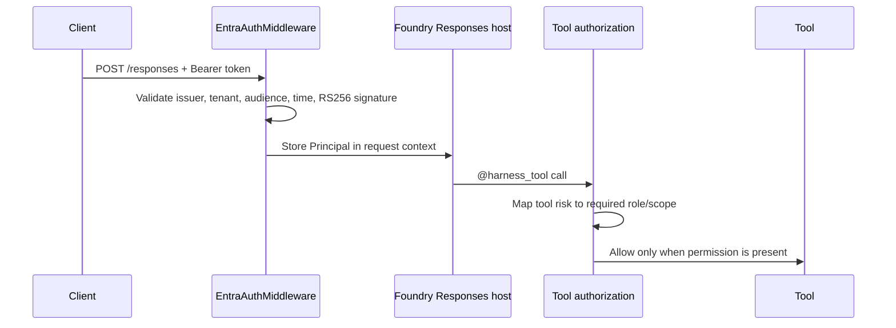

# Authentication and Authorization

## Overview

The Foundry Responses host can run behind an Entra ID inbound authentication layer. When `AUTH_MODE=entra`, `deploy/foundry/main.py` uses a pure-ASGI `EntraAuthMiddleware` to validate `Authorization: Bearer <token>` access tokens before the request reaches the agent runtime.



`GET /readiness` is exempt so platform health checks can run without a bearer token. Missing tokens return `401` with `WWW-Authenticate: Bearer`; invalid tokens return `401` with `error="invalid_token"`.

Validated tokens become a request-scoped `Principal` with:

- `subject`: `oid` when present, otherwise `sub`;
- `tenant`;
- `roles`;
- delegated scopes from `scp`;
- `app_id` from `azp` or `appid`.

## Azure Functions host

The Azure Functions / Durable Extension host under `deploy/functions/` is also Entra-aware when `AUTH_MODE=entra`.
`HarnessAgentFunctionApp` validates the inbound `Authorization: Bearer <token>` header in the HTTP trigger before it signals the durable entity. The default Azure Functions auth level remains `FUNCTION`, so callers must satisfy both checks in deployed Functions apps: a valid Function key for the HTTP trigger and a valid Entra bearer token for the harness.

Durable entities run after the HTTP trigger returns control to the Durable runtime, so a request `ContextVar` cannot carry the caller into the later tool call. The Functions host bridges that boundary by storing a principal summary in the durable `RunRequest.options` payload:

```python
from azure_agent_harness.auth import PRINCIPAL_OPTION_KEY, principal_to_dict

options = {PRINCIPAL_OPTION_KEY: principal_to_dict(principal)}
```

Agents hosted in Functions must include `PrincipalOptionsMiddleware()`. That middleware removes `PRINCIPAL_OPTION_KEY` from `context.options` before the chat client or model API is called, then rehydrates the `Principal` around the agent run when no in-process principal is already set. An existing in-process principal always wins over options, so a caller cannot forge a principal by posting an `options` body.

The serialized principal contains only `subject`, `tenant_id`, sorted `roles`, sorted `scopes`, `app_id`, and `name`. It never contains the access token or raw claims. Because `RunRequest.options` is part of the durable entity request, that principal summary may be persisted in durable entity state and should be treated as identity metadata.

Client-supplied `session_id` values are scoped per principal in Entra mode. The host prefixes the durable entity key with the first 16 hex characters of `sha256("<tenant_id>:<subject>")`, so the same caller can resume the same named conversation while different callers cannot collide on the same `session_id`.

Durable orchestrations or non-HTTP triggers that call agents directly do not pass through the HTTP bearer-token validator. Those code paths must validate or establish their caller identity and pass:

```python
options={PRINCIPAL_OPTION_KEY: principal_to_dict(principal)}
```

to the agent run themselves.

The Azure Functions MCP tool trigger is refused at startup in Entra mode. Function MCP triggers are invoked with system keys and do not carry an end-user Entra principal into the agent/tool boundary.

## Entra app registration

Azure portal wording changes over time; the labels below are approximate.

1. Register the API application in Microsoft Entra ID.
   - In App registrations, create a new registration for the harness API.
   - Record the application/client ID and tenant ID.
2. Set the Application ID URI.
   - In Expose an API, set the Application ID URI to a value such as `api://azure-agent-harness`.
   - Use the same value in `ENTRA_API_AUDIENCE`. You may also accept the app client ID as an audience when needed.
3. Require v2 access tokens.
   - In the app manifest, set `accessTokenAcceptedVersion` to `2`.
4. Define app roles for tool access.
   - Add these app roles with `allowedMemberTypes` including both `User` and `Application`:
     - `Tools.Read`
     - `Tools.Write`
     - `Tools.Financial`
     - `Tools.Destructive`
5. Optionally expose delegated scopes with the same names.
   - Add delegated scopes named `Tools.Read`, `Tools.Write`, `Tools.Financial`, and `Tools.Destructive` if interactive user clients need delegated access.
   - The authorization layer accepts either an app role in the `roles` claim or a delegated scope in the `scp` claim.
6. Assign access.
   - Assign app roles to users, groups, or client service principals that should call the host.
   - Keep assignments narrow. Permissions are evaluated at the tool boundary, not only at ingress.
7. Acquire a token from a client.
   - For Azure CLI testing, request a token for the API resource:

     ```bash
     az account get-access-token --resource api://azure-agent-harness
     ```

     This only works after the Azure CLI's public client ID (`04b07795-8ddb-461a-bbee-02f9e1bf7b46`) is added as an authorized client application under Expose an API; otherwise Entra returns a consent error. The CLI receives delegated scopes (`scp`), so expose the `Tools.*` scopes too or assign app roles to the signed-in user.

   - For client credentials, request the `.default` scope for the API:

     ```text
     scope=api://azure-agent-harness/.default
     ```

## Configuration

| Environment variable | Required | Default | Description |
| --- | --- | --- | --- |
| `AUTH_MODE` | No | `disabled` | Set to `entra` to enable inbound Entra ID authentication. `disabled` is for local development. |
| `ENTRA_TENANT_ID` | Yes when `AUTH_MODE=entra` | none | The primary Entra tenant ID. Used for issuer/JWKS discovery and as the default allowed tenant. |
| `ENTRA_API_AUDIENCE` | Yes when `AUTH_MODE=entra` | none | Comma-separated accepted audiences, for example `api://azure-agent-harness` and/or the API app client ID. |
| `ENTRA_ALLOWED_TENANT_IDS` | No | `ENTRA_TENANT_ID` | Comma-separated tenant allowlist. Tokens from tenants outside this list are rejected. |

`Settings.validate_auth()` runs at startup. It refuses `APP_ENV=production` unless `AUTH_MODE=entra`, and refuses `AUTH_MODE=entra` unless both tenant and audience are configured.

The middleware validates:

- `RS256` tokens only;
- signature using the tenant JWKS at `https://login.microsoftonline.com/<tenant>/discovery/v2.0/keys`;
- `exp` and `nbf`;
- configured audience;
- tenant allowlist;
- issuer, which must be either `https://login.microsoftonline.com/<tid>/v2.0` or `https://sts.windows.net/<tid>/`.

## Authorization model

Every `@harness_tool` call checks the caller has the permission mapped from the tool risk level.

| Tool risk | Required permission |
| --- | --- |
| `ToolRisk.READ` | `Tools.Read` |
| `ToolRisk.WRITE` | `Tools.Write` |
| `ToolRisk.FINANCIAL` | `Tools.Financial` |
| `ToolRisk.DESTRUCTIVE` | `Tools.Destructive` |

Permissions are flat, not hierarchical. `Tools.Write` does not imply `Tools.Read`, and `Tools.Destructive` does not imply any lower-risk permission.

The required permission may be granted as:

- an app role in the `roles` claim, for app-to-app callers or assigned users; or
- a delegated scope with the same name in the `scp` claim.

Unregistered tools are denied by default. Denials raise `AuthorizationError`, which is a `PolicyViolation`. `ToolPolicy.assert_allowed(tool_name, principal=...)` performs the same check. This enforcement happens in code regardless of the model's tool choice or approval mode.

With `AUTH_MODE=disabled`, local development tool calls run without a principal. With `AUTH_MODE=entra`, a tool call without a principal is denied, including any code path that bypasses the middleware.

## Local development

Use the default `.env.example` settings for local development:

```bash
AUTH_MODE=disabled
```

In this mode, the Foundry host does not require an inbound bearer token and tools run without a principal. Do not use disabled mode in production; startup validation rejects it when `APP_ENV=production`.

## Production checklist

- Set `APP_ENV=production`.
- Set `AUTH_MODE=entra`.
- Set `ENTRA_TENANT_ID` to the tenant that owns the API registration.
- Set `ENTRA_API_AUDIENCE` to the Application ID URI and any additional accepted audience values.
- Set `ENTRA_ALLOWED_TENANT_IDS` if callers from additional tenants are intentionally allowed.
- Define and assign only the app roles or delegated scopes each caller needs.
- Confirm `GET /readiness` is the only unauthenticated endpoint you rely on for the Foundry host, and that the Functions host requires both Function auth and Entra bearer tokens.
- Exercise at least one denied call for each high-risk tool class before production use.

## Known gaps and follow-ups

- Outbound calls to downstream APIs or MCP servers should use managed identity or On-Behalf-Of. Never forward the inbound token; token passthrough is forbidden by the MCP authorization specification.
- This repository does not yet ship an MCP server. Exposing tools over MCP, including protected resource metadata and RFC 9728 support, is a future step that would reuse this validator.
- Entra ID does not support OAuth Dynamic Client Registration, so MCP clients must be pre-registered.
